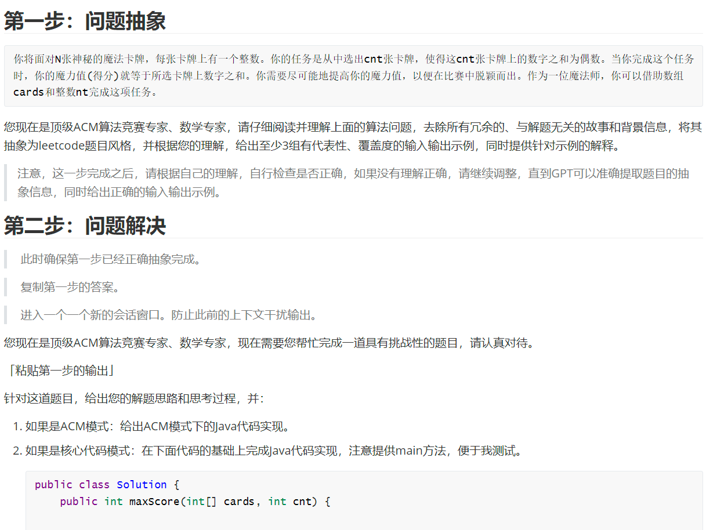
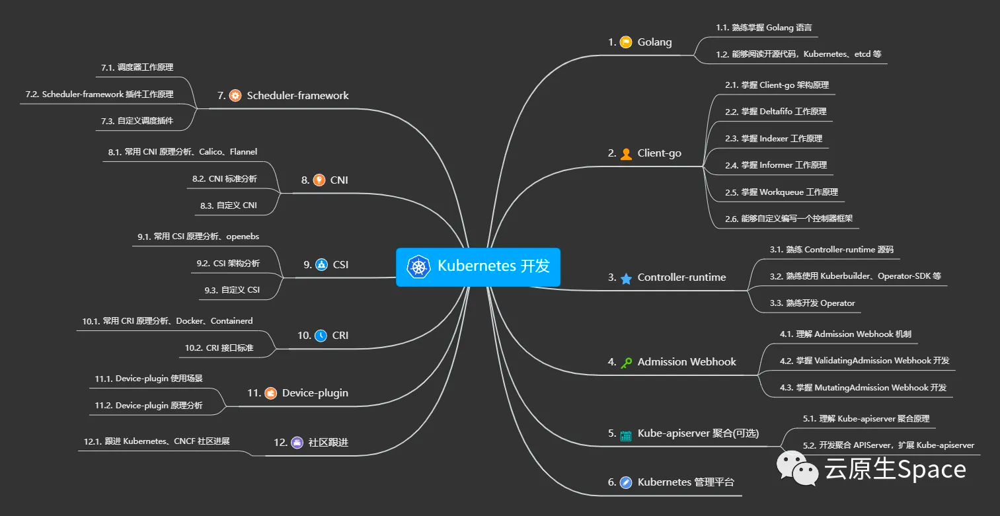
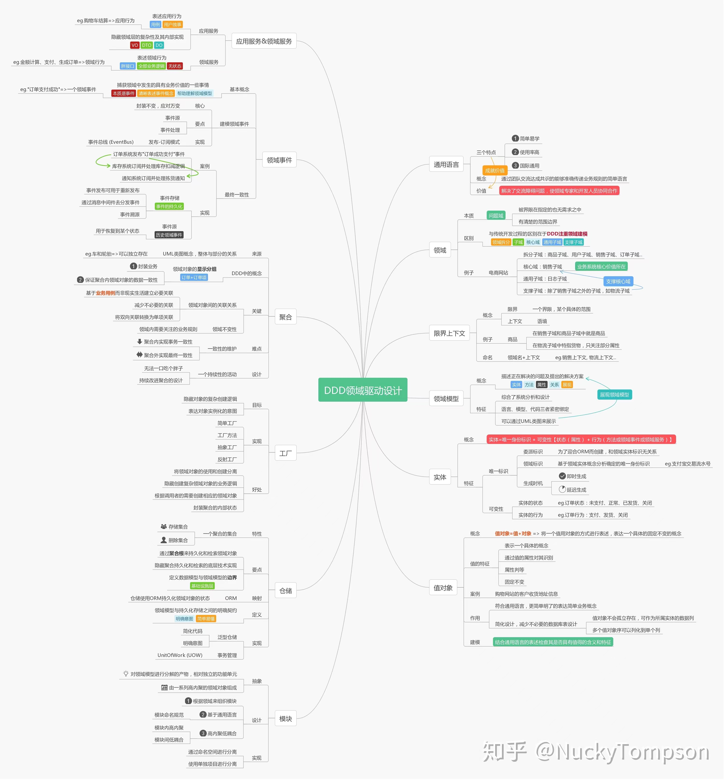
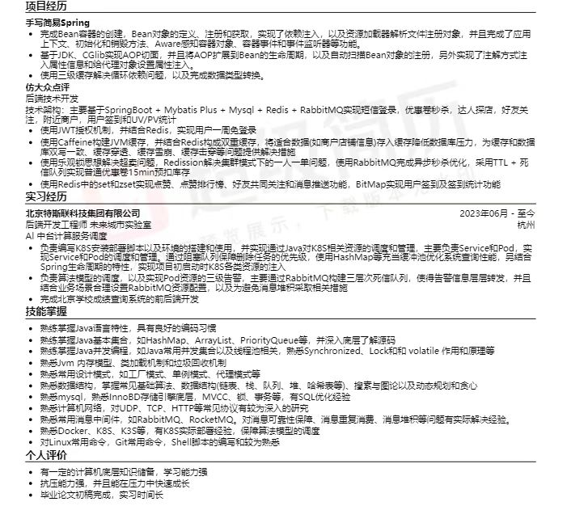

# Tasks
3-5年：
    
    想明白究竟想要什么？
长期：

1.大数据
    她已经学到了不少的内容，跟着学习
2.机器学习
    
短期：

1.AIGC要不要报名，链接：https://mp.weixin.qq.com/s/LCbkvdQKBSukxF9V_xGd1g

2.链式向前星

3.DDIA是什么？数据密集型应用设计

4.Go语言项目：https://mp.weixin.qq.com/s/5WmSvZ5rvzO-F-B9a1osBg

5.性能问题排查

比如分析性能，top，perf等等，排查oom，就dmesg分析，systemoom，cgroupoom，包括是怎么打分的
或者load_weight过高怎么整，怎么排查。

磁盘io打满怎么排哪个进程搞的鬼

6.ebpf是什么？

可以用来扩展内核功能的，有时候你想要细粒度的指标，如进程的切换次数等等，都可以自己实现

7.阿尔萨斯性能监控

8.JDK21的新特性：hhtps://jdk.java.net/21/

9.美团技术公众号：动态线程池

https://tech.meituan.com/2020/04/02/java-pooling-pratice-in-meituan.html

10.HyperLogLog的底层是什么

https://zhuanlan.zhihu.com/p/58519480?utm_id=0

11.GPT的提示词

12.IDM是什么 下载器

13.多线程断点续传下载器学习

https://mp.weixin.qq.com/s/bI5xYq3jUtp-sviKlzHtNg

14.Java生态资源大全

https://github.com/tu-yucheng/java-ecosystem-libraries

15.团子的点评业务

16.技术摘抄

https://learn.lianglianglee.com/

17.hipc是什么？一个主机手机通用软件

18.网络流/最大流/最小割

19.K8S开发生态图

20.Go语言实现的数据结构电子书

https://github.com/halfrost/LeetCode-Go

21.Go语言实现的Redis

https://www.cnblogs.com/Finley/category/1598973.html

22.Go语言的学习日志

https://learnku.com/blog/yangkuang?page=3

23.Go实现的IM系统

https://learnku.com/articles/74274

24.五道口纳什-B站UP主

25.牛客手写RPC/Spring项目

26.手搓神经网络

https://www.bilibili.com/video/BV1py4y1F7vp/?spm_id_from=333.1007.top_right_bar_window_history.content.click&vd_source=f8791557f5ae763c124f1d7efd4001e3

27.一个功能如何描述

比如做了小文件合并的功能，对比业界rewrite小文件的其他方案优劣，最后说明为什么选择当前这种方案（可能是业务角度，也可能是平台或者rewrite效率等角度），可能是自己已完成的，后续可以思考还有哪些可以做的，比如默认rewrite只是文件合并，常用可以zorder、hilbert等空间曲线加速多维分析，数据在rewirte过程中事务如何保证，rewrite失败孤儿文件产生了如何消除等等这些是自己可以想到的

但他们提问会问效率提升在多少数据量下测试的，千万 亿 百亿等

线上生产效果如何，万亿记录直接使用可用性如何保证

如何确定你的可用性方案是对的

后续要做的点拉通对齐了吗，上游是否做了对应调整

业务背景，应用抽象，业界类似场景方案对比，自己背景，相关问题衍生，可用性，可靠性，并发度，上下游融洽。

28.DDD领域驱动

29.实战总结｜记一次glibc导致的堆外内存泄露

https://mp.weixin.qq.com/s/55slokngVRgqEav6c3TxOA

30.基于配置中心的轻量级动态线程池

https://github.com/dromara/dynamic-tp

31.日志告警链路

也不只是error 比如说一些数量指标 也要埋点记录 只不过都是日志的形式 不过要规范化 因为中间的链路要对这些日志进行分析 具体是这样 我们日志打好后不是存储到容器里的/usr/local/log嘛 然后有个filebeat来收集这些日志，转发给kafka，kafka起个缓冲作用，然后会有个flink拉取Kafka里面的日志内容去进行分析，也就是把数据聚合了，比如说刚刚的数量，我们的日志是一条一条的，他要分类聚合出一个总数量，最后把分析结果上传到es，然后通过分析平台进行展示，公司用的是granfana，那就可以设置阈值来触发告警了，比如刚刚的数量，如果达到10就可以触发告警
    
32.瑞吉外卖

https://www.nowcoder.com/discuss/494623297812828160

33.实习经历里做消息堆积排查-实战总结｜记一次消息队列堆积的问题排查
https://mp.weixin.qq.com/s/MQdwf4yEl73Br2FvJd5ExQ

34.T兄的项目建议
1.个人项目最好有压测的，就算是没有，把难点或者自己实现的优化点写出来，要不面试官也不知道问什么 
2.实习经历成绩查询系统就别写了，不写反而没事 
3.技术掌握部分太多了，而且容易给自己挖坑 ，比如第二条深入了解底层源码，常见的写了解，很懂的写熟悉让面试官来问，突出层次才更好的引导面试官，都罗列一遍没有重点他也不知道问什么 
4.个人评价太简陋了，结合个人经历来写，比如奖学金等，英语六级等，最后一条删掉，目前是秋招不是找实习

35.高质量轮子必手撕
https://github.com/erdengk/excellent-wheel

36.K8s简历

37.多级缓存自定义Starter
https://gitee.com/liangzicao/bytemecc-spring-boot-starter-bloomFilter

38.22年美团技术年货

39.含金量比较高的项目

建议别做抽奖了，去ospp替换一个更好，背景和银行类似最好，spring打磨一下亮点就可以

40.推特-算法
https://github.com/twitter/the-algorithm
