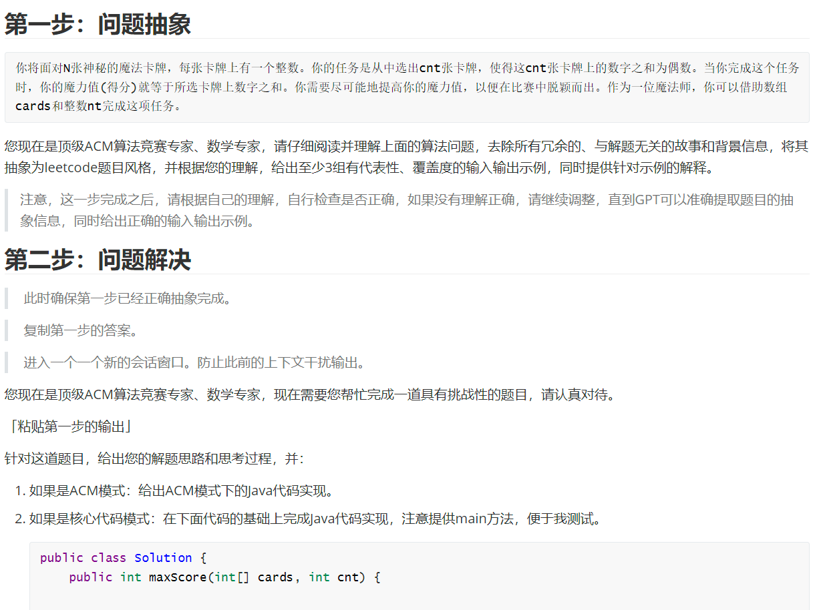

# Tasks
长期：

1.大数据

2.机器学习

短期：

1.AIGC要不要报名，链接：https://mp.weixin.qq.com/s/LCbkvdQKBSukxF9V_xGd1g

2.链式向前星

3.DDIA是什么？数据密集型应用设计

4.Go语言项目：https://mp.weixin.qq.com/s/5WmSvZ5rvzO-F-B9a1osBg

5.性能问题排查

比如分析性能，top，perf等等，排查oom，就dmesg分析，systemoom，cgroupoom，包括是怎么打分的
或者load_weight过高怎么整，怎么排查。

磁盘io打满怎么排哪个进程搞的鬼

6.ebpf是什么？

可以用来扩展内核功能的，有时候你想要细粒度的指标，如进程的切换次数等等，都可以自己实现

7.阿尔萨斯性能监控

8.JDK21的新特性：hhtps://jdk.java.net/21/

9.美团技术公众号：动态线程池

https://tech.meituan.com/2020/04/02/java-pooling-pratice-in-meituan.html

10.HyperLogLog的底层是什么

https://zhuanlan.zhihu.com/p/58519480?utm_id=0

11.GPT的提示词

12.IDM是什么 下载器

13.多线程断点续传下载器学习

https://mp.weixin.qq.com/s/bI5xYq3jUtp-sviKlzHtNg

14.Java生态资源大全

https://github.com/tu-yucheng/java-ecosystem-libraries

15.团子的点评业务

16.技术摘抄

https://learn.lianglianglee.com/

17.hipc是什么？一个主机手机通用软件

18.未完待续/微信+qq

    
